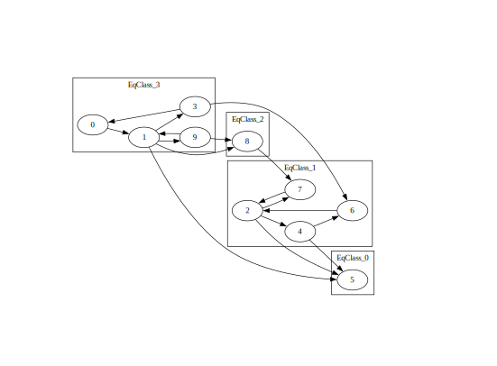
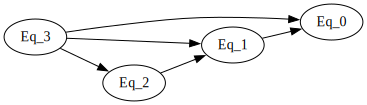

# SCC Visualization

A visualization tool of strong connected components.

usage:

```bash
g++ main.cpp -o main
./main in.txt example.dot exampleDAG.dot
```

`in.txt` format description:

- The first line consists of two integers, n and m, representing the number of nodes and the number of edges, respectively.
- Following are m lines, each containing two integers, a and b, indicating a directed edge from node a to node b. The range of a and b is \[0, n\).

`example.dot` and `exampleDAG.dot` can be rendered by graphviz.



